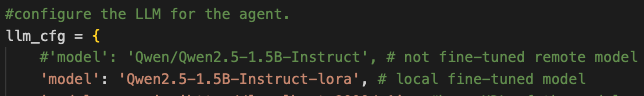

## 1. Preparation 
### a. Deploy a model with vLLM
1. Install vLLM with `pip install vllm`
2. Follow this [link](https://github.com/QwenLM/Qwen2.5?tab=readme-ov-file#vllm) to deploy and serve a model locally
3. Follow this [link](https://github.com/QwenLM/Qwen-Agent) to customize an agent to query the model

### b. Set up SSH Tunnel for your_machine> -> Axes -> GPU VM
#### On local machine:
1. `ssh-keygen -t ed25519 -C "<your_email>"`
2. `ssh-copy-id -i ~/.ssh/id_ed25519.pub <your_id>@axes.cs.virginia.edu`
3. then `ssh <your_id>@axes.cs.virginia.edu` to login axes server

#### On axes:
1. SSH to the GPU VM
2. copy your local machine's ssh key to `~/.ssh/authorized_keys`

#### Then you will be able to ssh to the GPU VM with 
1. `ssh -J <your_id>@axes.cs.virginia.edu ubuntu@<your_vm_ip>`
2. ports mapping `ssh -L 9000:<your_vm_ip>:8000 -J <your_id>@axes.cs.virginia.edu ubuntu@<your_vm_ip>`

## 2. Run this project
### Structure
- folder `Qwen2.5-1.5B-Instruct-lora` contains the lora fine tuned model
- `interface.py` is the interface implemented with `gradio`
- `model_agent.py` is the agent that bridges interface and model, it also parses the response from the model

### Hardware/software requirements
- GPU is required
- Nvidia GPU Driver Installation with this [link](https://stevenlamp.com/nvidiamldrivers)
- Miniconda Installation with this [link](https://stevenlamp.com/minianainstall)

### Environment requirements
- vLLM: `pip install vllm`
- gradio: `pip install gradio`
- agent supports: `pip install -U "qwen-agent[gui,rag,code_interpreter,python_executor]"`

### Model deployment and interface running
1. in `model_agent.py`, comment/uncomment the following blocks to specify fine-tuned/not fine-tuned models
    
2. Model selection
    - deploy model with fine-tuned model: `vllm serve Qwen2.5-1.5B-Instruct-lora --dtype=half`
    - deploy model with not fine-tuned remote model: `vllm serve Qwen/Qwen2.5-1.5B-Instruct --dtype=half`
3. Interface
    - start the interface with `python interface.py`